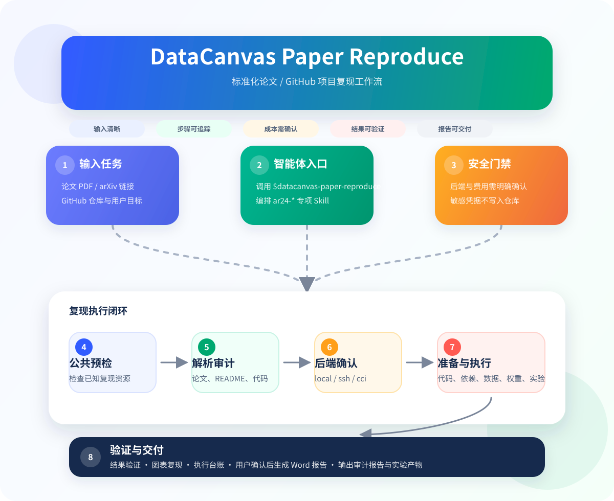
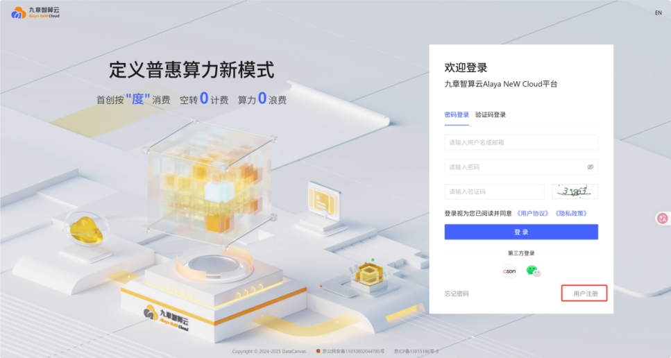
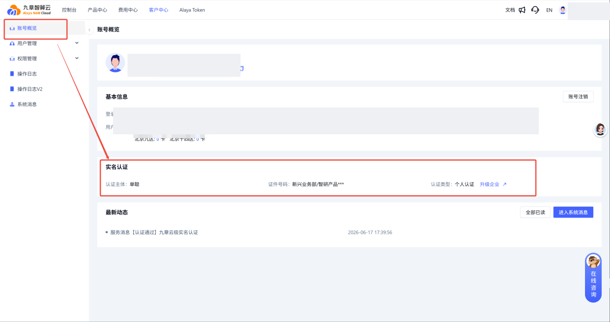
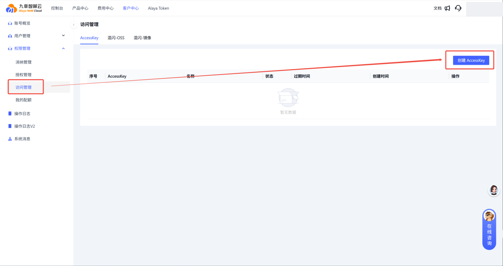
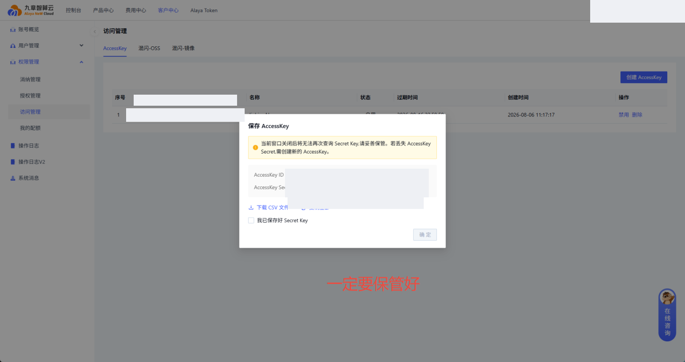

# DataCanvas Paper Reproduce

DataCanvas Paper Reproduce 是面向论文与 GitHub 项目复现的智能体 Skill 套件，适用于 Claude Code、Codex、OpenCode、OpenClaw 等代码智能体。

它将“复现一篇论文”或“跑通一个开源项目”的过程拆解为标准化工作流，覆盖项目审计、论文解析、环境准备、数据与权重准备、实验执行、结果验证和报告生成等环节，帮助用户更系统地完成复现任务。

推荐调用入口：

```text
$datacanvas-paper-reproduce
```

## 项目核心功能

- **论文与项目解析**：读取论文、README 和代码结构，提取 baseline、超参数、依赖、数据集和模型权重需求。
- **复现可行性审计**：识别依赖风险、资源需求、受限数据/模型、潜在阻断项，并生成项目审计报告。
- **多算力来源支持**：
  - **本地算力**：使用本机 CPU / GPU 进行复现测试；
  - **SSH 远程算力**：连接已有远程 GPU 服务器；
  - **CCI 容器算力**：通过 CCI 容器实例远程使用 GPU 算力资源。
- **环境与资产准备**：按流程准备代码、依赖环境、数据集、模型权重和运行目录。
- **实验执行与验证**：执行 smoke test、推理、微调或数值实验，记录日志、指标、耗时和设备信息。
- **多轮执行台账**：保留每次尝试的 run id、执行状态、失败原因和产物路径，避免覆盖历史记录。
- **复现报告生成**：在用户明确确认后，生成 Word 格式复现报告。

## 项目核心流程



该流程图概括了从用户输入论文或 GitHub 仓库，到预检、解析审计、后端确认、环境与资产准备、实验执行、结果验证和报告交付的完整闭环。

关键约束：

- 后端选择必须由用户明确确认；沉默、超时或上下文不足不构成授权。
- 使用 CCI 等可能产生费用的资源前，必须展示资源信息并等待用户确认。
- 最终 DOCX 报告必须在实验结束后由用户再次明确授权生成。
- 每轮执行都应保留独立记录，失败、部分完成和用户中止也不能覆盖旧轮次。

## 安装使用

### 1. 克隆仓库

```bash
git clone https://github.com/hitcdl2019-ux/datacanvas-paper-reproduce.git
cd datacanvas-paper-reproduce
```

### 2. 安装到智能体 skills 目录

#### Codex

```bash
mkdir -p "${CODEX_HOME:-$HOME/.codex}/skills"
for skill_dir in datacanvas-* ar24-*; do
  [ -d "$skill_dir" ] || continue
  ln -sfn "$(pwd)/$skill_dir" "${CODEX_HOME:-$HOME/.codex}/skills/$(basename "$skill_dir")"
done
```

#### Claude Code

```bash
mkdir -p "$HOME/.claude/skills"
for skill_dir in datacanvas-* ar24-*; do
  [ -d "$skill_dir" ] || continue
  ln -sfn "$(pwd)/$skill_dir" "$HOME/.claude/skills/$(basename "$skill_dir")"
done
```

#### OpenCode

```bash
mkdir -p "${XDG_CONFIG_HOME:-$HOME/.config}/opencode/skills"
for skill_dir in datacanvas-* ar24-*; do
  [ -d "$skill_dir" ] || continue
  ln -sfn "$(pwd)/$skill_dir" "${XDG_CONFIG_HOME:-$HOME/.config}/opencode/skills/$(basename "$skill_dir")"
done
```

#### OpenClaw

```bash
mkdir -p "$HOME/.openclaw/skills"
for skill_dir in datacanvas-* ar24-*; do
  [ -d "$skill_dir" ] || continue
  ln -sfn "$(pwd)/$skill_dir" "$HOME/.openclaw/skills/$(basename "$skill_dir")"
done
```

> 如果运行环境不适合软链接，也可以把 `datacanvas-*` 和 `ar24-*` 目录复制到对应智能体的 skills 目录。

### 3. 调用示例

本地算力：

```text
Use $datacanvas-paper-reproduce to reproduce this GitHub project: <github_url>
Paper: <paper_url_or_pdf_path>
Use local backend. Ask me before running any mutable command.
```

SSH 远程算力：

```text
Use $datacanvas-paper-reproduce to reproduce this GitHub project: <github_url>
Paper: <paper_url_or_pdf_path>
Use SSH backend. I will provide the SSH command when you ask for it.
```

CCI 容器算力：

```text
Use $datacanvas-paper-reproduce to reproduce this GitHub project with CCI backend: <github_url>
Paper: <paper_url_or_pdf_path>
I have configured ALAYANEW_ACCESS_KEY and ALAYANEW_SECRET_KEY in the environment.
Please run CCI preflight first, show available resources, and wait for my explicit confirmation before creating any CCI instance.
```

## CCI 算力申请与配置

如果希望通过本项目使用 DataCanvas / 九章智算云 CCI 容器 GPU 算力，需要先完成 CCI 权限开通和访问参数配置。

### 1. 申请 CCI 权限

CCI（Container Computing Instance）是九章智算云提供的容器计算实例能力，可用于远程连接 GPU 算力资源。

1. 打开官网：`https://www.alayanew.com`，点击页面右下角 **用户注册**，完成账号注册。

   

2. 登录后，进入右上角头像菜单，选择 **账号概览 → 实名认证**，完成个人实名认证。

   

3. 访问：`https://www.alayanew.com`，进入 **头像 → 权限管理 → 访问管理**，点击 **创建 AccessKey**。

   

4. 创建后保存以下两项：
   - `AccessKey ID`
   - `AccessKey Secret`

   

> 上述截图已做脱敏处理。`AccessKey Secret` 只应保存在本地私有配置或安全凭据系统中，不要提交到 GitHub、AI 社区、README、issue 或对话记录中。

### 2. 配置 CCI 访问参数

创建私有环境变量文件：

```bash
mkdir -p ~/.config/datacanvas-paper-reproduce
chmod 700 ~/.config/datacanvas-paper-reproduce
nano ~/.config/datacanvas-paper-reproduce/cci.env
```

写入以下内容：

```bash
# 必填：从九章智算云访问管理页面获取
export ALAYANEW_ACCESS_KEY="<your-access-key-id>"
export ALAYANEW_SECRET_KEY="<your-access-key-secret>"

# 推荐默认资源参数；实际资源仍以 preflight 查询和用户确认结果为准
export ALAYANEW_AIDC_ID=5
export ALAYANEW_CCI_PRODUCT_CODE="PRD-CCI-5-5"
export ALAYANEW_CCI_GPU_COUNT=1
export ALAYANEW_CCI_IMAGE="registry.hd-04.alayanew.com:8443/alayanew-public/pytorch:2.12-cuda13.2-13ee37acb9fb17353115338ac018cbd3bd460d32"
```

保存后限制权限：

```bash
chmod 600 ~/.config/datacanvas-paper-reproduce/cci.env
```

每次启动智能体或复现任务前加载：

```bash
source ~/.config/datacanvas-paper-reproduce/cci.env
```

参数说明：

| 环境变量 | 必填 | 说明 |
| --- | --- | --- |
| `ALAYANEW_ACCESS_KEY` | 是 | CCI Open API AccessKey ID。 |
| `ALAYANEW_SECRET_KEY` | 是 | CCI Open API AccessKey Secret。 |
| `ALAYANEW_AIDC_ID` | 是 | 智算中心 ID，用于筛选资源、镜像和 NAS。 |
| `ALAYANEW_CCI_PRODUCT_CODE` | 是 | 期望 CCI 产品规格编码。 |
| `ALAYANEW_CCI_GPU_COUNT` | 是 | 期望 GPU 数量。 |
| `ALAYANEW_CCI_IMAGE` | 是 | 期望使用的容器镜像。 |

Open API 使用 HMAC-SHA256 签名认证；本仓库脚本会基于 `ALAYANEW_ACCESS_KEY` 和 `ALAYANEW_SECRET_KEY` 自动生成请求签名，用户无需手工拼接 `Authorization` 头。

### 3. 验证 CCI 配置

加载凭据：

```bash
source ~/.config/datacanvas-paper-reproduce/cci.env
```

确认必填变量存在：

```bash
test -n "${ALAYANEW_ACCESS_KEY:-}" && echo "ALAYANEW_ACCESS_KEY set"
test -n "${ALAYANEW_SECRET_KEY:-}" && echo "ALAYANEW_SECRET_KEY set"
```

执行只读 preflight，查询可用规格、镜像和 NAS：

```bash
python3 ar24-instance-manage/scripts/cci_manager.py \
  --state .ar24/cci/demo/cci_state.json \
  preflight \
  --session-id demo \
  --aidc-id "${ALAYANEW_AIDC_ID:-5}"
```

preflight 成功后，输出会包含：

- 可用 CPU / GPU 产品规格；
- 可用公共镜像；
- 已有 NAS 存储；
- 缺失项或阻断原因。

> CCI 创建实例前必须经过 preflight，并由用户在智能体对话中明确确认资源规格。脚本不会因为默认值、沉默或超时而自动创建计费资源。若 preflight 提示缺少 `existing_writable_nas`，需要先联系平台或管理员开通可写 NAS 存储。

## 复现产物

根据任务进度，可能生成：

- 项目审计报告：`<repo_name>_Audit_Report.md`
- 执行历史台账：`execution_run_history.json`
- CCI 资源状态与脱敏证据：`cci_state.json` 及相关 step 产物
- 实验日志、指标、图表和中间文件
- 用户确认后的 Word 报告：`<repo_name>_final_reproduce_report.docx`

## 安全与费用提醒

- 不要把 `ALAYANEW_ACCESS_KEY`、`ALAYANEW_SECRET_KEY`、token、SSH 密码或私钥提交到仓库。
- 不要在公开 issue、AI 社区评论、README 或 prompt 中粘贴真实凭据。
- CCI 容器和 GPU 资源可能产生费用；创建、保留、停止和释放实例前请确认计费规则。
- 复现结束后应确认 CCI 实例已释放，避免持续计费。
- 受限数据集、闭源模型权重和商业软件许可证需要用户自行确认访问权限。

## 架构说明

```text
datacanvas-paper-reproduce/   # DataCanvas 品牌入口，用户优先调用
ar24-auto-reproduct/          # 内部复现主流程，定义 step_0 到 step_8
ar24-instance-manage/         # 本地 / SSH / CCI 后端管理
ar24-project-analysis/        # 项目审计
ar24-paper-analysis/          # 论文解析
ar24-dependency-prep/         # 依赖准备
ar24-data-download/           # 数据准备
ar24-weight-download/         # 权重准备
ar24-repro-report/            # Word 报告生成
```

保留 `ar24-*` 命名是为了保证内部脚本路径稳定。普通用户只需要调用：

```text
$datacanvas-paper-reproduce
```

## 本地校验

```bash
for skill_dir in datacanvas-* ar24-*; do
  [ -d "$skill_dir" ] || continue
  python3 /path/to/quick_validate.py "$skill_dir"
done
```
